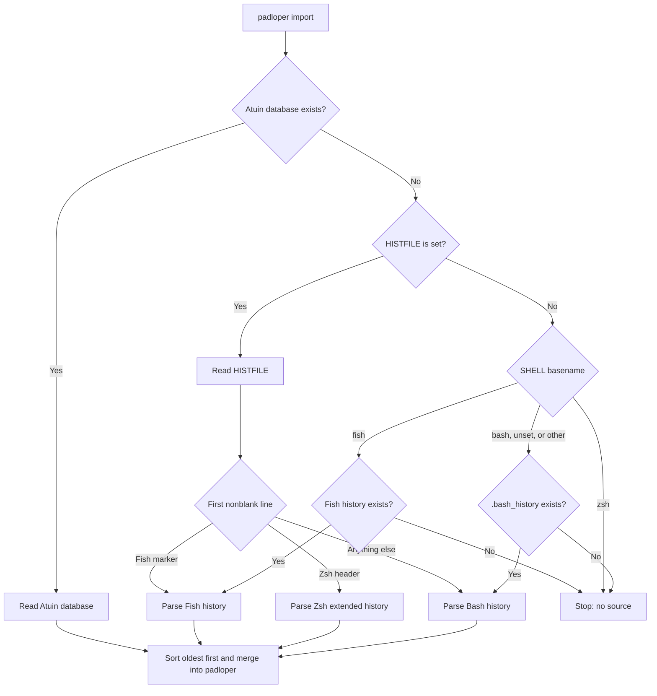

# padloper

A minimalist sqlite-backed shell-history recorder and searcher. A tiny atuin,
after [stinkpot](https://tangled.org/oppi.li/stinkpot).

Shell hooks record every command you run. Ctrl+r opens a fuzzy searcher and puts
the pick back on your prompt line. One row per distinct command, newest first.
No configuration.

## Install

```bash
# Straight from GitHub:
cargo install --git https://github.com/eljpsm/padloper

# With Nix:
nix run github:eljpsm/padloper

# From a clone (installs to ~/.cargo/bin):
make install
```

## Usage

Add to your shell config:

```bash
# .bashrc
eval "$(padloper init bash)"

# .zshrc
eval "$(padloper init zsh)"

# config.fish
padloper init fish | source
```

Then:

```bash
# Bring over Atuin, Bash, Zsh, or Fish history. Atuin wins. HISTFILE wins
# next. Otherwise padloper uses the history for $SHELL.
padloper import

# Press ctrl+r or the up arrow to search.

# The last 50 commands, tab separated.
padloper list

# What the hook calls. You never run this yourself.
padloper add --exit 0 -- ls
```

## Keybinds

| Context | Key                  | Action                                      |
| ------- | -------------------- | ------------------------------------------- |
| Prompt  | `ctrl+r`, up arrow   | Open the searcher                           |
| Search  | Type                 | Filter commands                             |
| Search  | Up arrow, `ctrl+p`   | Select an older command                     |
| Search  | Down arrow, `ctrl+n` | Select a newer command                      |
| Search  | `ctrl+r`             | Toggle commands from the current directory  |
| Search  | Backspace            | Delete one character                        |
| Search  | `ctrl+w`             | Delete one word                             |
| Search  | `ctrl+u`             | Clear the query                             |
| Search  | Enter                | Run the selected command                    |
| Search  | Right arrow, Tab     | Put the selected command on the prompt line |
| Search  | Esc, `ctrl+c`        | Cancel                                      |

## Import flow

The first selected source wins. A read or parse error stops the import instead
of falling through to another source.



History lives in `$XDG_DATA_HOME/padloper/history.db`, or
`~/.local/share/padloper/history.db`.

## Acknowledgements

passdown is inspired by:

- [atuin](https://github.com/atuinsh/atuin)
- [stinkpot](https://tangled.org/oppi.li/stinkpot)

## License

GPL-3.0-or-later. See [LICENSE](LICENSE).
